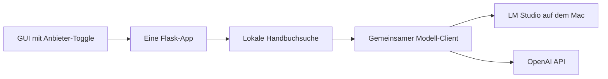

# Waschmaschinen-RAG: LM Studio und OpenAI in einer Anwendung

Ein deutschsprachiger Handbuchassistent für die mitgelieferte Siemens-Anleitung.
**Ein Server, eine Oberfläche und ein Umschalter zwischen LM Studio und OpenAI API.**
Die bestehende Repository-Adresse mit dem Suffix `_LocalLLM` bleibt aus Gründen
der Git-Historie bestehen. Sie enthält jetzt beide Betriebsarten.



## Start

Voraussetzung: Python 3.12. Die geprüften Versionen stehen in
[requirements.txt](requirements.txt). Modellgewichte benötigen beim ersten
Download Internet und mehrere GB freien Speicher. Der BGE-Reranker benötigt
zusätzlich spürbar RAM und Rechenzeit.

macOS / Linux:

```sh
python3.12 -m venv .venv
source .venv/bin/activate
python -m pip install -r requirements.txt
python server.py
```

Windows PowerShell:

```powershell
py -3.12 -m venv .venv
.venv\Scripts\python.exe -m pip install -r requirements.txt
.venv\Scripts\python.exe server.py
```

Danach **http://127.0.0.1:3001** öffnen. Die HTML-Datei nicht direkt öffnen.
Der erste Suchlauf lädt Modelle und erstellt den Index. Weitere Anfragen
verwenden den Cache.

### Lokales Modell auf dem Mac

1. In LM Studio ein zur Hardware passendes Chat-/Instruct-Modell laden.
2. Den lokalen OpenAI-kompatiblen Server starten (üblicher Port: 1234).
3. `profiles/local/.env.example` nach `profiles/local/.env` kopieren.
4. In dieser Datei die genaue Modell-ID aus LM Studio eintragen:

```dotenv
LOCAL_LLM_ENDPOINT=http://127.0.0.1:1234/v1
LOCAL_LLM_MODEL=die-tatsaechliche-modell-id
```

Bei genau einem verfügbaren Chatmodell ist automatische Modellauswahl möglich.
**127.0.0.1 bezeichnet den Rechner, auf dem die Python-App läuft.** Für LM Studio
auf deinem Mac daher vorzugsweise auch diese Anwendung auf dem Mac starten.
Eine App auf Windows erreicht den Mac nicht über 127.0.0.1. Für einen Betrieb
über dein privates Netzwerk braucht sie dessen tatsächlichen Endpoint und
entsprechende Server-/Netzwerkkonfiguration.

### OpenAI API

Im Support-Tab **„OpenAI-Schlüssel für diese Sitzung“** öffnen, den Key in das
Passwortfeld eingeben und **„Für diese Sitzung verwenden“** wählen. Anschließend
ist der Umschalter **OpenAI API** aktiv. Die Eingabe selbst löst keinen API-Aufruf aus.

Der Key bleibt ausschließlich im Arbeitsspeicher des lokalen App-Servers,
getrennt nach Browsersitzung. Er steht weder in Dateien noch in Cookies,
localStorage oder sessionStorage. Das Eingabefeld wird nach der Übernahme geleert.
**„Key entfernen“**, ein Serverneustart oder acht Stunden Gültigkeitsdauer beenden
die weitere Nutzung. Bereits laufende Anbieteraufrufe können noch zu Ende laufen.

Der Server verwendet den Key zur Anmeldung an der OpenAI API. Frage und passende
Handbuchauszüge werden dann an OpenAI übertragen; es entstehen API-Kosten.
Voreingestelltes Modell: gpt-4.1-mini. Optional lässt sich OPENAI_MODEL in
profiles/openai/.env konfigurieren, **der API-Key gehört dort nicht hinein**.
Die Web-App übernimmt auch keinen OPENAI_API_KEY aus Umgebungsvariablen.

### Gemeinsame Einstellungen

Optional `.env.example` nach `.env` im Projektstamm kopieren.
Standardwerte: Port 3001, Anbieter `local`, Retrieval `hybrid`.
Bereits gesetzte Prozess-Umgebungsvariablen haben Vorrang vor Profildateien.
`LLM_PROVIDER=openai` ändert die Vorauswahl; der GUI-Schalter bleibt verfügbar.
Lokale Konfigurationsdateien bleiben durch Git ignoriert. OpenAI-Schlüssel werden ausschließlich über die Oberfläche entgegengenommen.

## Was der Assistent tut

- **Hybrid (Standard):** multilingual-e5-small erzeugt Vektoren, exakte
  Fehlercodes ergänzen die Kandidaten, bge-reranker-v2-m3 sortiert die Treffer.
- **PageIndex (experimentell):** Das gewählte LLM sucht IDs in Listen von
  Abschnittstiteln und Zusammenfassungen. Zusätzliche LLM-Aufrufe können
  langsamer und bei OpenAI kostenpflichtig sein.
- Ein gemeinsamer Prompt begrenzt Antworten auf Handbuchauszüge.
- Unbekannte Fehlercodes und zu schwache Hybrid-Treffer führen zur Ablehnung.
- Die Oberfläche zeigt die Antwort sowie aufklappbare Originalauszüge.
  Auszüge ermöglichen die Prüfung, garantieren aber noch keine Belegtreue.
- SSE überträgt die Antwort schrittweise. Angezeigte Tokenwerte stammen aus
  der Antwort-API; die PageIndex-Auswahl ist darin nicht enthalten.

Es gibt **keine externe Datenbank**. LlamaIndex speichert Vektoren und Nodes
unter `storage/` in JSON-Dateien. Der alternative Baum steht in
`pageindex_tree.json`.

## Prüfung und Weiterentwicklung

```sh
python -m pip install -r requirements-dev.txt
python -m pytest -q
python eval/run_eval.py --output docs/evaluation/hybrid-rerank.json
python eval/run_eval.py --no-rerank --output docs/evaluation/hybrid-no-rerank.json
python eval/run_eval.py --vector-only --no-rerank --output docs/evaluation/vector.json
```

Die zehn vorhandenen Fragen messen **Stichworttreffer**, nicht die Korrektheit
der generierten Antworten. Details, Messwerte und Einschränkungen stehen im
[Prüfbericht](docs/AUDIT.md).

Für PDF-Neuverarbeitung und optionalen PageIndex-Baumaufbau:

```sh
python -m pip install -r requirements-optional.txt
python parser.py --pdf siemens-handbuch.pdf --output siemens_wissen_neu.md
```

Neue Extraktionen zuerst mit dem PDF vergleichen, insbesondere Tabellen und
Warnhinweise. Erst danach die aktive Wissensdatei ersetzen. Ein geänderter
Inhalt invalidiert den Vektorcache und den alten PageIndex-Baum.
Der Baumaufbau benötigt zusätzlich `PAGEINDEX_MODEL=lm_studio/<Modell-ID>`
und gegebenenfalls `LM_STUDIO_API_BASE`; anschließend
`python build_pageindex_tree.py`. Der optionale Builder verwendet LiteLLM,
die laufende App den gemeinsamen OpenAI-SDK-Client.

## Dokumentation

- [PowerPoint-Foliensatz](docs/slides/RAG_Waschmaschine_Dokumentation.pptx):
  weißer Stil, Theorie, technische Diagramme, Betrieb und Prüfresultate.
- [Technische Dokumentation](docs/TECHNICAL.md): Datenfluss, Konfiguration und Grenzen.
- [Prüfbericht](docs/AUDIT.md) und [Messprotokolle](docs/evaluation/).
- [Notebook](notebooks/document_processing_pipeline.ipynb):
  reproduzierbarer Einstieg über dieselben Projektfunktionen.
- [PageIndex-Herkunft und Lizenz](pageindex/VENDOR.md).

Die ältere DOCX-Datei und der Optimierungsentwurf vom Juli 2026 sind historische
Unterlagen. Für die aktuelle Anwendung gelten die oben verlinkten Markdown-
Dokumente und die PPTX.

Die Anwendung ist eine lokale Lehr- und Demoanwendung. Der voreingestellte
Flask-Server lauscht nur auf dem eigenen Rechner. Der tatsächliche Mac mit
LM Studio muss separat praktisch geprüft werden. Modellantworten ersetzen
keine Sicherheits- und Kundendiensthinweise des Originalhandbuchs.
