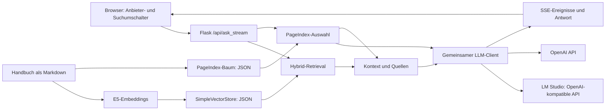

# Technische Dokumentation

Stand: 19.09.2026. Gemeinsame Anwendung für lokale LM-Studio- und OpenAI-Modelle.

## Architektur und Zuständigkeiten

| Komponente | Datei | Aufgabe |
|---|---|---|
| GUI | index.html | Anbieterauswahl, Suchverfahren, Streaming und Quelltexte |
| Web-App | server.py | Validierung, Retrieval, Kontextbudget, Antwortformat, SSE |
| Modellzugang | llm_client.py | Getrennte Clients und Profile für local / openai |
| Hybrid-RAG | rag_engine.py | Chunking, Embeddings, Index, Lookup und Reranking |
| PDF-Parser | parser.py | Docling-Export mit physischen PDF-Seitenmarkern |
| PageIndex-Suche | pageindex_engine.py | Batch-Auswahl gültiger Abschnitts-IDs |
| Baumaufbau | build_pageindex_tree.py | Optionaler vorbereitender LiteLLM-Aufruf |
| Kurzfassungen | build_pageindex_summaries.py | Deutsche Stichwortzeilen je Abschnitt, lokal via LM Studio |

Der Anbieter wird explizit pro Anfrage weitergereicht. Ein Umschalten verändert
keine globalen Umgebungsvariablen und keine Anfragen anderer Browser.
Der Backend-Cache hält nur den lokalen Client. OpenAI-Clients entstehen für die aktuelle Anfrage und werden danach geschlossen. Ein Lock schützt das
gemeinsame Laden und den Zugriff auf lokale Retrieval-Modelle.

## RAG-Theorie und konkrete Umsetzung

RAG verbindet externe Dokumente mit generativer Antworterstellung zur Anfragezeit.
Die Gewichte des Antwortmodells bleiben unverändert. Die ursprüngliche
[RAG-Arbeit](https://arxiv.org/abs/2005.11401) und der
[Überblick](https://arxiv.org/abs/2312.10997) beschreiben das Prinzip;
die hier eingesetzte Pipeline ist eine konkrete Engineering-Variante.

### Aufbereitung

Das Original-PDF hat 48 Seiten. Die vorhandene Markdown-Datei enthält
extrahierte Texte und Tabellen, aber keine verlässlichen Metadaten zur Fundseite.
Der überarbeitete Docling-Parser exportiert jede PDF-Seite einzeln und ergänzt
`<!-- pdf-page: N -->`. Die Neufassung wurde an der Fehlercodetabelle geprüft;
die aktive Gesamtdatei wurde nicht blind durch eine neue Extraktion ersetzt.

Markdown-Überschriften bilden Abschnitte. Große Tabellen werden zeilenweise
aufgeteilt; Header und vorherige Zeilenbezeichnung bleiben bei Fortsetzungen
erhalten. Danach begrenzt ein Splitter mit dem **E5-Tokenizer** die Chunks auf
440 Tokens bei 40 Tokens Überlappung. Metadaten werden nicht in den
Embedding-Text hineinkopiert.

### Embeddings und Suche

[multilingual-e5-small](https://huggingface.co/intfloat/multilingual-e5-small)
erzeugt 384-dimensionale Vektoren und verarbeitet höchstens 512 Tokens.
Fragen tragen `query:`, Textpassagen `passage:`.
Kosinusähnlichkeit misst den Winkel zwischen Frage- und Textvektor.
Das ist eine Ranghilfe und kein Nachweis einer fachlich richtigen Antwort.

Das Projekt kombiniert Top-12-Vektortreffer mit exakten, normalisierten
Fehlercodes (z. B. E18, E:18, Fehlercode:18). E:180 gilt nicht als E:18.
Doppelte Nodes werden entfernt. Dieser Hybrid-Ansatz enthält **weder BM25
noch Reciprocal Rank Fusion**.

Der mehrsprachige Cross-Encoder
[bge-reranker-v2-m3](https://huggingface.co/BAAI/bge-reranker-v2-m3)
bewertet Frage und Kandidat gemeinsam. Die Implementierung bildet seine Logits
explizit mit Sigmoid ab und liefert bis zu fünf Kandidaten. Für den Antwortkontext
bleiben nur Kandidaten mit Score ≥ max(0,15; 0,5 × bester Score). Der relative
Filter ist über CONTEXT_SCORE_RATIO konfigurierbar und ebenfalls eine Heuristik. Der Filterwert
0,15 ist ein Projektparameter, keine kalibrierte Wahrheitswahrscheinlichkeit.
Ohne Reranker akzeptiert der konservative Fallback nur exakte Fehlercodes.
Ein unbekannter gefragter Code darf keine fremde Codebedeutung übernehmen.

### LLM-Umformulierung bei erfolgloser Suche

Bei einer unbelegten Hybrid-Suche ohne expliziten Fehlercode nutzt `server.py`
höchstens einen zusätzlichen Aufruf des gewählten Antwortanbieters.
`query_rewrite.py` fordert eine kurze Suchfrage an: Tippfehler korrigieren,
Umgangssprache vereinheitlichen, keine Diagnose oder Lösung hinzufügen.
Fachfremde Fragen sollen `null` ergeben. Der Parser akzeptiert JSON und einen
umschließenden JSON-Codeblock, begrenzt die Länge und verwirft hinzugefügte
Fehlercodes oder veränderte Zahlen. Eine misslungene Umformulierung führt zur
ursprünglichen Ablehnung, nicht zu einer ungestützten Antwort.

Die neue Suchfrage durchläuft denselben Retriever, Reranker und Relevanzfilter.
Die Generierung erhält weiterhin die Originalfrage. Bei Erfolg zeigt das Feld
`search_query` im JSON-/SSE-Ergebnis die verwendete Suchformulierung in der GUI.
Es gibt keine rekursive Suche. Gute Ersttreffer und Fragen mit Fehlercodes
lösen keinen Umformulierungsaufruf aus. Bei OpenAI gilt der Sitzungsschlüssel
nur für diesen Anfrage-Client; der Client wird anschließend geschlossen.
Zusätzliche Suchaufrufe verursachen Laufzeit und gegebenenfalls API-Kosten;
die angezeigten Tokenzahlen umfassen weiterhin nur die Antwortgenerierung.
Die Sinnwahrung der Umformulierung ist eine LLM-Leistung, keine formale Garantie.

### Zusammenhang von Arbeitsanleitungen

Die flache OCR-Struktur trennt bei der Pumpenreinigung den Warnhinweis von den
Arbeitsschritten. `manual_context.py` ergänzt deshalb vier am vorhandenen Handbuch
geprüfte Abschnittsgruppen: Pumpenreinigung, Notentriegelung, erster Waschgang
und Transport. Das ist kuratierte Metadatenarbeit für genau diese Anleitung,
keine allgemeine automatische Rekonstruktion beliebiger PDF-Hierarchien.

Chunk-Metadaten und eingebettete Texte enthalten den Dokumentkontext. Nach dem
Retrieval ersetzt die App einen Treffer innerhalb einer solchen Gruppe durch
deren vollständigen Originaltext und entfernt doppelte Gruppen. Damit bleiben
Warnungen, Stromtrennung und Vorbereitung zusammen mit den Arbeitsschritten.
Der Quelltext selbst bleibt unverändert. Die maximal 440 Tokens gelten für
Embedding-Chunks; ein expandierter Antwortbeleg darf größer sein. Das globale
Antwortbudget bleibt 14.000 Zeichen. Die Parser-Version `md-v5-procedure-context`
erzwingt einen Indexneuaufbau. `CONTEXT_SCORE_RATIO` wirkt erst zur Anfragezeit.

### Speicherung und Cache

[LlamaIndex](https://developers.llamaindex.ai/python/framework/module_guides/storing/vector_stores/)
persistiert SimpleVectorStore, Docstore und Index-Metadaten in JSON.
Es gibt keinen separaten Datenbankserver und keine Chroma-, Qdrant-, PostgreSQL-
oder Neo4j-Anbindung. Der Suchindex wird im App-Prozess geladen.

Ein SHA-256-Fingerprint bindet den Cache an Markdown-Inhalt, Modellname,
Parser-Version, Chunkgröße, Überlappung und Präfixlogik. FileLock verhindert
gleichzeitigen Indexaufbau durch mehrere Prozesse. Defekte bzw. veraltete Caches
werden neu aufgebaut. Modelle werden im benutzereigenen Hugging-Face-Cache
gespeichert (standardmäßig `~/.cache/huggingface/hub`, über `HF_HOME` bzw.
`HF_HUB_CACHE` konfigurierbar). Modell-Caches und Python-Umgebungen gehören nicht
in einen zwischen Betriebssystemen synchronisierten OneDrive-Ordner:
Snapshot-Symlinks können dabei zu leeren Dateien werden.

Alternativen für mehr Dokumente: PostgreSQL mit
[pgvector](https://github.com/pgvector/pgvector) kombiniert relationale Daten
und Vektoren; [Qdrant](https://qdrant.tech/documentation/overview/) bietet
Vektorsuche mit Payload-Filtern; [Chroma](https://docs.trychroma.com/docs/overview/introduction)
speichert Dokumente und Embeddings. Keines dieser Systeme ist hier installiert.

### PageIndex

Der vorhandene JSON-Baum enthält 187 Abschnitte mit Titel, Summary und Text.
Alle 187 Texte wurden gegen das vorhandene Markdown geprüft. Der Quellhash
verhindert den Einsatz eines Baums zu einer anderen Markdown-Version.

Nennt die Frage einen Fehlercode, sucht die App ihn zuerst deterministisch in
den Abschnittstexten (exakter Code, kein Präfix). Bis zu fünf Treffer kommen
ohne LLM-Aufruf zurück; bei mehr wählt das LLM nur unter diesen Kandidaten.
Enthält kein Abschnitt den Code, läuft die Auswahl wie bei freien Fragen.

Freie Fragen: Die App flacht die Abschnittsübersichten ab, fragt das gewählte
LLM in Batches von 30 und akzeptiert ausschließlich gültige IDs des jeweiligen
Batches. Bei mehr als fünf Kandidaten folgt eine globale Auswahl. Das vermeidet eine
rein nach Kapitelposition abgeschnittene Auswahl. Ungültiges JSON wird als
leere Auswahl behandelt. Die Übersichten enthalten zusätzlich den zugeordneten
Arbeitskontext. Ausgewählte Teilabschnitte werden ebenfalls zu vollständigen
Arbeitsanleitungen erweitert. Anschließend passt die App nur vollständige
Abschnitte in das Kontextbudget ein, bevorzugt exakte gefragte Fehlercodes und
zeigt ausschließlich die tatsächlich übergebenen Belege. Passt kein ausgewählter
Abschnitt vollständig hinein, wird ein Fehler ausgelöst; Texte werden nicht
mitten in einem Warnhinweis abgeschnitten.

Die Übersicht je Abschnitt besteht aus Titel und einer Kurzfassung von höchstens
160 Zeichen. `build_pageindex_summaries.py` erzeugt sie als deutsche
Stichwortzeilen (Bauteile, Bedienelemente, Störungsbilder) mit dem lokalen
Modell; Abschnitte bis 160 Zeichen werden wörtlich übernommen, Fehlercodes
stehen am Anfang der Zeile. Die früheren englischen Beschreibungen
("This document provides …") trugen für die Auswahl kaum Information.

Kosten auf dem Mac (gemma-4-12b in LM Studio, 20.09.2026): Die Auswahl liest
rund 10 000 Tokens je freier Frage in sieben Aufrufen; bei etwa 200 Tokens/s
Prompt-Verarbeitung sind das rund 50–60 Sekunden vor der Antwort. Die Zeit
hängt an den Tokens, nicht an der Zahl der Aufrufe. Fragen mit Fehlercode
brauchen durch den Vorfilter keinen Auswahlaufruf. Messwerte in
[`docs/evaluation/`](evaluation/README.md).

Die Variante orientiert sich an [PageIndex](https://github.com/VectifyAI/PageIndex),
implementiert aber keine vollständige agentische Tiefensuche des aktuellen SDK.
Nichtleere ausgewählte Texte sind noch kein semantischer Relevanznachweis.
PageIndex bleibt experimentell.

## Generierung und API

System- und Nutzerrolle sind getrennt. Frage und Handbuchauszüge werden als
JSON-Daten im Nutzerinhalt übermittelt. Der Systemprompt fordert ausschließlich
belegte Antworten und den Erhalt von Sicherheits-/Kundendiensthinweisen.
Ein Zeichenbudget (Standard 14.000) lehnt übergroßen Kontext explizit ab.
Das ist kein exaktes modellabhängiges Tokenbudget.

Antworten verwenden drei XML-ähnliche Tags: summary, manual_intro, manual_steps.
Die App validiert dieses Format grundlegend und wandelt Schritte in Checkboxen.
Sie prüft damit Struktur, nicht die semantische Richtigkeit jeder Behauptung.
Am Tokenlimit abgeschnittene Antworten gelten als Fehler.

| Route | Funktion |
|---|---|
| GET / | Benutzeroberfläche |
| GET /siemens-logo.png | Logo |
| GET /assets/qrcode.min.js | Lokal gespeicherte QR-Bibliothek |
| GET /api/health | Prozess erreichbar; keine Modell-Verbindungsprüfung |
| GET /api/modes | Verfahren, Sitzungsstatus und CSRF-Token |
| POST /api/openai_key | Key für diese Sitzung setzen oder entfernen |
| POST /api/ask | Vollständige JSON-Antwort |
| POST /api/ask_stream | SSE über fetch mit POST |

Anfragen: `{"frage":"Was bedeutet E:18?","mode":"hybrid","provider":"local"}`.
Fragen dürfen 1–2000 Zeichen enthalten, Request-Bodies maximal 16 KiB.
Ungültige Eingaben ergeben HTTP 400, nicht verfügbare Modelle/Fehler HTTP 503.
Nach Beginn eines Streams meldet ein SSE-`error` einen Fehler.
Abfolge: `status`, `meta`, `token`, `result`, `[DONE]`.

HTML-Ausgabe maskiert Modell- und Nutzerdaten; Quelltexte verwendet die GUI mit
textContent. Nur ausdrücklich freigegebene statische Dateien sind erreichbar.
Eine neue Frage oder Umschaltung bricht die alte Browseranfrage ab. Bereits
begonnene Retrieval-/Anbieterberechnung kann trotzdem noch Kosten verursachen.

## Konfiguration

| Variable | Standard | Bedeutung |
|---|---|---|
| LLM_PROVIDER | local | Vorauswahl im GUI / CLI |
| PORT / HOST | 3001 / 127.0.0.1 | App-Adresse |
| LOCAL_LLM_ENDPOINT | http://127.0.0.1:1234/v1 | LM-Studio-Endpunkt |
| LOCAL_LLM_MODEL | leer | Exakte ID; Autoauswahl nur bei einem Chatmodell |
| OPENAI_MODEL | gpt-4.1-mini | Getestete kompatible Modellfamilie |
| RETRIEVAL_MODE | hybrid | Suchvorauswahl |
| RETRIEVE_K / FINAL_K | 12 / 5 | Kandidaten / Kontextabschnitte |
| CHUNK_TOKENS / CHUNK_OVERLAP | 440 / 40 | Tokenbezogene Zerlegung |
| ENABLE_RERANK | 1 | 0 schaltet Reranking aus |
| GUARDRAIL_MIN_SCORE | 0.15 | Relevanzfilter |
| CONTEXT_MAX_CHARS | 14000 | Zeichenbudget für Antwortkontext |
| ANSWER_MAX_TOKENS | 1024 | Maximale Antwortlänge |
| PAGEINDEX_BATCH / PAGEINDEX_MAX_NODES | 30 / 5 | Abschnittsauswahl |
| PAGEINDEX_SUMMARY_CHARS | 160 | Kurzfassung je Abschnitt in der Auswahl |

Provider-Profile stehen unter `profiles/local/.env` und `profiles/openai/.env`.
Das OpenAI-Profil enthält nur Modellkonfiguration. Den API-Key nimmt ausschließlich die lokale Oberfläche entgegen; Dateien und Umgebungsvariablen liefern keinen Web-App-Key. Nach Konfigurationsänderungen den Server
neu starten. Prozessvariablen haben Vorrang. Andere OpenAI-Modellfamilien können
andere API-Parameter benötigen; Modellwechsel deshalb separat testen.

Für spätere Läufe ohne Modell-Netzwerkabrufe müssen alle Gewichte bereits
vorhanden sein. Optional `HF_HUB_OFFLINE=1`, `TRANSFORMERS_OFFLINE=1` und
denselben `HF_HOME` wie beim Download setzen. Lokaler Betrieb setzt dann keine
Cloud-Antwort-API voraus. Der optionale Parser kann eigene Modell-Downloads brauchen.

## Schutz des API-Schlüssels

Die Eingabe erfolgt in einem Passwortfeld. POST /api/openai_key übernimmt den Key
für die aktuelle Browsersitzung in SessionKeys, einen gesperrten In-Memory-Speicher.
Cookies enthalten nur zufällige Sitzungs-ID und CSRF-Token, niemals den Key.
HttpOnly und SameSite=Strict schützen das Sitzungscookie. Das Feld wird nach
der Übernahme geleert; kein localStorage, sessionStorage und keine Dateiablage.

Die Gültigkeit ist auf acht Stunden begrenzt. Entfernen und Serverneustart
sperren weitere Aufrufe mit dem bisherigen Key. OpenAI-Clients werden nicht
über Anfragen hinweg zwischengespeichert. Antworten und Fehlerprotokolle geben
keinen Key und keine vollständigen Anbieter-Exceptions zurück.

Die App akzeptiert nur Loopback-Verbindungen, bekannte localhost-Hostnamen
und passende Origin-Header. Die Key-Route verlangt zusätzlich einen
CSRF-Token. API-Antworten tragen Cache-Control: no-store. CSP, Frame-Schutz
und nosniff ergänzen die HTML-Maskierung. Konfiguration orientiert sich an der
[Flask-Sicherheitsdokumentation](https://flask.palletsprojects.com/web-security/).
Die lokale HTTP-Verbindung bleibt auf dem Rechner; OpenAI-Anfragen nutzen HTTPS.

Der Key dient ausschließlich als API-Anmeldedatum und wird nicht in den
Handbuch-/Nutzerprompt eingebaut. Diese Architektur ist für einen lokalen
Einprozess-Server gedacht. Die CLI ist für LM Studio vorgesehen.

## Grenzen

- Der echte Mac-/LM-Studio-End-to-End-Lauf steht noch aus.
- Vorhandenes Markdown enthält teilweise OCR-Artefakte und Sonderzeichenfehler.
- Historische Querverweise sind ausdrücklich keine belegten Fundseiten.
- Der FAQ-Testbestand ist klein und verwendet Stichwort-Proxys.
- Folgefragen werden textlich ergänzt; es gibt keinen vollständigen Chatverlauf.
- Die Oberfläche ist ausschließlich lokal erreichbar. Ein QR-Link mit localhost funktioniert nicht auf einem anderen Gerät.
- Die Demo hat keine Anmeldung und keinen gehärteten Mehrbenutzerbetrieb.

## Vorlesen und mobile Anleitung

`mobile/speech.js` kapselt die Web Speech API. Die Ausgabe umfasst Zusammenfassung,
Einleitung und sämtliche Schritte, bevorzugt eine lokale deutsche Stimme und
teilt lange Texte in kurze Abschnitte. Start, Ende, Abbruch und Fehler sind im GUI
sichtbar. Verfügbare Stimmen und die hörbare Ausgabe hängen vom Browser und dem
Betriebssystem ab. Die Anwendung ruft dafür keine OpenAI-Audio-API auf.

`mobile/guide.js` erzeugt einen versionierten JSON-Datensatz aus Frage, Antwort,
Schritten, Quellenhinweisen und Datum. Keine Schlüssel, Cookies oder vollständigen
Retrieval-Daten werden übernommen. Gzip und Base64url komprimieren den Datensatz
im URL-Fragment `#g1.…`. Beim HTTP-Abruf wird dieses Fragment nicht an GitHub Pages
übertragen. Die öffentliche Leseseite lädt nur eigene statische Dateien und ruft
keine API auf. Jeder Besitzer des Links kann die Antwort lesen; es handelt sich
nicht um verschlüsselte oder zugriffsgeschützte Freigabe.

Der QR-Link ist auf 1.900 Zeichen begrenzt. Zu lange Antworten werden nicht
gekürzt, sondern als eigenständige HTML-Datei angeboten. Der Decoder begrenzt
dekomprimierte Inhalte auf 32.000 Bytes, prüft das Schema und maskiert alle
Antworttexte vor der HTML-Darstellung. Symbole sind allgemeine Orientierung,
keine Abbildung gerätespezifischer Bauteile. Offline-HTML enthält keine Scripts
oder Netzwerkanfragen. Abhakzustände werden nicht dauerhaft gespeichert.

GitHub Pages veröffentlicht über `.github/workflows/mobile-guide.yml`
ausschließlich `mobile/`. Der Flask-Server bleibt auf Loopback beschränkt.
Die statische Leseseite erweitert den Zugriff auf die lokale API nicht.

Referenzen: [Web Speech API](https://developer.mozilla.org/en-US/docs/Web/API/Web_Speech_API),
[CompressionStream](https://developer.mozilla.org/en-US/docs/Web/API/CompressionStream/CompressionStream),
[GitHub Pages](https://docs.github.com/en/pages/getting-started-with-github-pages/configuring-a-publishing-source-for-your-github-pages-site).
